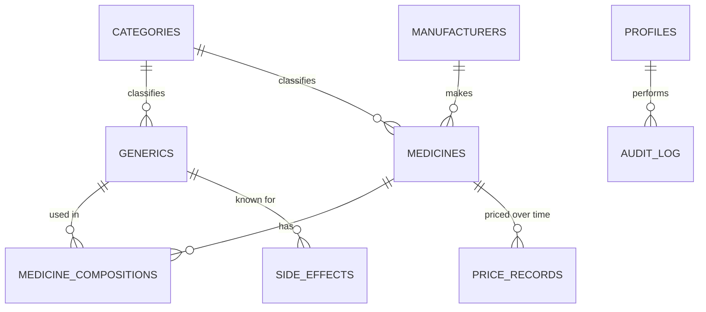

# Technical Requirements Document (TRD)
## DawaCompare — Medicine Price & Generic Alternative Comparator

| | |
|---|---|
| **Version** | 1.0 |
| **Date** | July 10, 2026 |
| **Companion doc** | `PRD-DawaCompare.md` — read that first for *what/why*. This doc is *how*. |
| **Cost constraint** | Everything below must run on **$0/month**: free hosting tiers + the free Google AI Studio (Gemini) API key. No credit card required anywhere in this stack. |

---

## 1. System Overview

```
┌────────────────────┐        ┌──────────────────────────┐
│   Browser (User)    │◄──────►│  Next.js App (Vercel)     │
│  React UI, Tailwind │  HTTPS │  Pages/Server Actions/API │
└────────────────────┘        │  routes                   │
                               └───────────┬───────────────┘
                                           │
                 ┌─────────────────────────┼─────────────────────────┐
                 ▼                         ▼                         ▼
      ┌────────────────────┐   ┌────────────────────┐   ┌────────────────────────┐
      │ Supabase (Postgres) │   │ Google Gemini API   │   │ External data services  │
      │ - DB + Auth + RLS   │   │ (via AI Studio key)  │   │ - OpenFDA (labels)       │
      │ - Storage (images)  │   │ server-side only      │   │ - Overpass API (OSM      │
      └────────────────────┘   └────────────────────┘   │   pharmacies)            │
                                                          └────────────────────────┘
```

- **Frontend + backend-for-frontend:** one Next.js app, deployed to Vercel. API routes / server actions act as the only place that talks to Gemini and to Supabase's service-role key — the browser never sees secret keys.
- **Database & Auth:** Supabase (managed Postgres + Row Level Security + Auth), free tier.
- **AI:** Google Gemini, called server-side with a free API key generated in Google AI Studio.
- **Maps:** Leaflet + OpenStreetMap tiles (no key) + Overpass API (no key) for pharmacy locations.

---

## 2. Tech Stack

| Layer | Choice | Why (given the free-of-cost constraint) |
|---|---|---|
| Frontend framework | **Next.js (App Router) + React** | Best-supported target for current AI coding tools; file-based routing keeps the structure predictable for an AI agent to navigate. |
| Styling | **Tailwind CSS** + a small component set (e.g., shadcn/ui) | Fast to generate consistently via AI, avoids one-off inline styles, easy to keep visually coherent (see PRD §10). |
| Charts | **Recharts** | Simple line chart for price history, works cleanly in React. |
| Maps | **Leaflet.js** + OpenStreetMap tiles | Zero-cost, no API key, no credit card — unlike Google Maps JS API which requires billing setup even on the free tier. |
| Database | **Supabase Postgres** (free tier) | Real relational DB (needed for the medicine/generic/price relationships below), built-in Auth + Row Level Security, generous free tier, no card required to start. |
| Auth | **Supabase Auth** (email/password, admin role via a `profiles` table) | Avoids building auth from scratch; integrates directly with RLS policies. |
| AI | **Google Gemini API** via a free Google AI Studio key | Explicit constraint from the brief. Called only from server routes. |
| Hosting (frontend) | **Vercel** (Hobby/free tier) | Native Next.js support, git-push deploys, generous free bandwidth for a student project's traffic level. |
| Version control | **GitHub** (free) | Required for Vercel's git-based deploys; also just good practice to show in a report/demo. |
| Image storage | **Supabase Storage** (free tier) | Medicine images, same platform as the DB, one fewer service to configure. |

> **Note on staying current:** free-tier limits (rate limits, storage caps) for Supabase, Vercel, and Gemini change periodically. Before your demo, do a 5-minute check of each provider's current pricing page (links in Appendix A) — treat the numbers in this document as "true as of July 2026," not permanent.

---

## 3. Repository Structure (suggested)

```
dawacompare/
├── app/
│   ├── page.tsx                     # Landing page
│   ├── search/page.tsx              # Search results
│   ├── medicine/[id]/page.tsx       # Medicine detail page
│   ├── compare/page.tsx             # Compare tool
│   ├── admin/
│   │   ├── layout.tsx               # Auth-gated layout
│   │   ├── page.tsx                 # Admin overview
│   │   ├── medicines/page.tsx       # CRUD table
│   │   ├── medicines/[id]/edit/page.tsx
│   │   ├── import/page.tsx          # CSV bulk import
│   │   └── login/page.tsx
│   └── api/
│       ├── medicines/search/route.ts
│       ├── medicines/[id]/route.ts
│       ├── medicines/[id]/alternatives/route.ts
│       ├── medicines/[id]/price-history/route.ts
│       ├── medicines/[id]/similar/route.ts
│       ├── pharmacies/nearby/route.ts
│       ├── ai/symptom-search/route.ts
│       └── ai/explain-side-effects/route.ts
├── components/                      # UI components
├── lib/
│   ├── supabase/ (client.ts, server.ts, admin.ts)
│   └── gemini.ts                    # small wrapper around fetch()
├── scripts/
│   └── seed/                        # one-off scripts to import Kaggle CSVs → Supabase
├── supabase/
│   └── schema.sql                   # everything in Section 5, ready to run
├── .env.local.example
├── PRD-DawaCompare.md
├── TRD-DawaCompare.md
└── README.md
```

---

## 4. Data Model — Entity Overview



**Key relationship the whole product depends on:** two medicines are "generic alternatives" of each other **if and only if** their `medicine_compositions` rows match exactly (same set of `generic_id` + `strength_value` + `strength_unit`). This must be a real query, not a fuzzy name match — get this right first, everything else builds on it.

---

## 5. Database Schema (Postgres / Supabase — ready to paste into the SQL editor)

```sql
-- Extensions
create extension if not exists "pgcrypto";

-- Therapeutic categories
create table categories (
  id uuid primary key default gen_random_uuid(),
  name text not null unique,          -- e.g. "Analgesic", "Antibiotic"
  description text,
  created_at timestamptz default now()
);

-- Generic / active ingredient ("salt formula")
create table generics (
  id uuid primary key default gen_random_uuid(),
  name text not null unique,          -- e.g. "Paracetamol"
  description text,
  category_id uuid references categories(id),
  created_at timestamptz default now()
);

-- Manufacturers
create table manufacturers (
  id uuid primary key default gen_random_uuid(),
  name text not null unique,
  country text,
  created_at timestamptz default now()
);

-- Medicines (brand-level product)
create table medicines (
  id uuid primary key default gen_random_uuid(),
  brand_name text not null,
  manufacturer_id uuid references manufacturers(id),
  category_id uuid references categories(id),
  dosage_form text,                   -- tablet, syrup, injection, cream, drops...
  pack_size text,                     -- "10 tablets", "60ml bottle"
  prescription_required boolean default false,
  drap_registration_no text,
  country text default 'Pakistan',
  image_url text,
  is_active boolean default true,
  created_by uuid references auth.users(id),
  created_at timestamptz default now(),
  updated_at timestamptz default now()
);
create index idx_medicines_brand_name on medicines using gin (to_tsvector('simple', brand_name));

-- Composition: many-to-many medicines <-> generics, with strength
create table medicine_compositions (
  id uuid primary key default gen_random_uuid(),
  medicine_id uuid references medicines(id) on delete cascade,
  generic_id uuid references generics(id),
  strength_value numeric,
  strength_unit text,                 -- mg, ml, mcg, %...
  unique (medicine_id, generic_id)
);

-- Prices — a time series, this IS the price history
create table price_records (
  id uuid primary key default gen_random_uuid(),
  medicine_id uuid references medicines(id) on delete cascade,
  price numeric not null,
  currency text default 'PKR',
  source text,                        -- 'DRAP MRP', 'Pharmacy survey', 'Seed/demo'
  recorded_at timestamptz default now(),
  recorded_by uuid references auth.users(id)
);
create index idx_price_records_medicine on price_records (medicine_id, recorded_at);

-- Side effects (generic-level, since that's how the underlying data is usually sourced)
create table side_effects (
  id uuid primary key default gen_random_uuid(),
  generic_id uuid references generics(id),
  description text not null,
  severity text check (severity in ('mild','moderate','severe')),
  source text,
  created_at timestamptz default now()
);

-- Pharmacies (Phase 2)
create table pharmacies (
  id uuid primary key default gen_random_uuid(),
  name text not null,
  address text,
  city text,
  lat double precision,
  lng double precision,
  phone text,
  osm_id text,
  created_at timestamptz default now()
);

-- Admin/editor profile layered on top of Supabase auth.users
create table profiles (
  id uuid primary key references auth.users(id) on delete cascade,
  full_name text,
  role text check (role in ('admin','editor')) default 'editor',
  created_at timestamptz default now()
);

-- Audit trail
create table audit_log (
  id uuid primary key default gen_random_uuid(),
  actor_id uuid references auth.users(id),
  action text,                        -- 'insert' | 'update' | 'delete'
  table_name text,
  record_id uuid,
  changes jsonb,
  created_at timestamptz default now()
);
```

### 5.1 Row Level Security (RLS)

```sql
alter table medicines enable row level security;
alter table price_records enable row level security;
alter table generics enable row level security;

-- Public can read active/public data
create policy "public read medicines" on medicines
  for select using (is_active = true);
create policy "public read generics" on generics
  for select using (true);
create policy "public read prices" on price_records
  for select using (true);

-- Only admins/editors can write
create policy "admin write medicines" on medicines
  for all using (
    exists (select 1 from profiles p where p.id = auth.uid() and p.role in ('admin','editor'))
  );
create policy "admin write prices" on price_records
  for all using (
    exists (select 1 from profiles p where p.id = auth.uid() and p.role in ('admin','editor'))
  );
```
Apply the same read/write pattern to `manufacturers`, `medicine_compositions`, `side_effects`, `pharmacies`, and `categories`.

---

## 6. API Design

Implemented as Next.js route handlers. All admin-mutating routes must re-check the caller's Supabase session server-side (never trust a hidden UI element alone).

| Method | Route | Purpose |
|---|---|---|
| GET | `/api/medicines/search?q=&category=&priceMin=&priceMax=&form=&prescription=` | Search + filter |
| GET | `/api/medicines/[id]` | Full detail record |
| GET | `/api/medicines/[id]/alternatives` | Exact-composition matches, sorted by price |
| GET | `/api/medicines/[id]/similar` | Same category, different composition |
| GET | `/api/medicines/[id]/price-history` | Time series for the chart |
| POST | `/api/compare` | Body: `{ ids: string[] }` → side-by-side payload |
| GET | `/api/pharmacies/nearby?lat=&lng=&radius=` | Proxies Overpass API (see §7.4) |
| POST | `/api/ai/symptom-search` | Body: `{ query }` → Gemini-classified categories/generics, then queries DB |
| POST | `/api/ai/explain-side-effects` | Body: `{ genericId }` → Gemini plain-language rewrite |
| POST | `/api/admin/medicines` (+ PUT/DELETE) | Admin CRUD, session + role checked |
| POST | `/api/admin/import` | CSV bulk import, admin only |

---

## 7. Data Sources & Integration Details

### 7.1 Kaggle datasets (primary seed data — generic ↔ brand ↔ side-effect structure)
Use these to bulk-populate `generics`, `medicine_compositions`, `side_effects`, and as a *reference* price structure. Remember: this data is largely Indian-market (see PRD §11.2) — great for the salt-formula/substitute/side-effect graph, but tag `currency` and `country`/`source` honestly on anything price-related.

- **250k Medicines — Usage, Side Effects and Substitutes** — `kaggle.com/datasets/shudhanshusingh/250k-medicines-usage-side-effects-and-substitutes` — best single source for substitute/side-effect mapping.
- **A-Z Medicine Dataset of India** — `kaggle.com/datasets/shudhanshusingh/az-medicine-dataset-of-india` — ~250k rows: price, manufacturer, composition, availability.
- **India Medicines and Drug Info Dataset** (1mg-derived, ~300k rows) — `kaggle.com/datasets/apkaayush/india-medicines-and-drug-info-dataset` — note license: **CC BY-NC-SA 4.0**, attribute it, non-commercial use only (fine for a student project).
- **Indian Pharmaceutical Products** (~250k rows) — `kaggle.com/datasets/rishgeeky/indian-pharmaceutical-products` — price (INR), manufacturer, packaging, composition.
- **Medicines Dataset** — `kaggle.com/datasets/drowsyng/medicines-dataset` — smaller, includes disease/use mapping and images.

Download via the Kaggle website (or Kaggle CLI with a free account), clean with a Python/pandas script in `scripts/seed/`, and load into Supabase via `psql`/Supabase's SQL editor or the `supabase-js` client in a one-off Node script.

### 7.2 OpenFDA (side effects, labeling, generic↔brand cross-reference — global reference layer)
Free, no signup required for light use (an optional free API key raises your rate limit — get one at `open.fda.gov` if you plan to call it often).

- Base endpoint: `https://api.fda.gov/drug/label.json`
- Example query — pull labeling data for a known generic:
  ```
  https://api.fda.gov/drug/label.json?search=openfda.generic_name:"ibuprofen"&limit=5
  ```
- Useful label fields: `drug_interactions`, `adverse_reactions`, `warnings`, `indications_and_usage`, `openfda.brand_name`, `openfda.generic_name`.
- **Important limitation:** this is **U.S. FDA data** — real for drug chemistry/side effects of well-known international generics (paracetamol, ibuprofen, amoxicillin, etc.), but brand names and prices are U.S.-specific and should not be shown as Pakistani brands/prices. Use it to *enrich* the side-effects table for well-known generics, not as your pricing source.
- Docs: `open.fda.gov/apis/drug/label/`

### 7.3 DRAP — Pakistan-specific pricing & registration (the data that makes this feel locally real)
DRAP (Drug Regulatory Authority of Pakistan) publishes:
- **MRP (Maximum Retail Price) search** — `public.dra.gov.pk/cp/alien/` and `e.dra.gov.pk/public/price`
- **Registered product list** — `eapp.dra.gov.pk/WebProductIndex.php`
- Main site / news — `dra.gov.pk`

These are searchable portals, not bulk-download APIs, and the registered-product list explicitly states it's a **provisional list not intended for research or statistical citation**. Practical approach for a student project:
1. Manually look up ~30–100 well-known Pakistani brands (Panadol, Brufen, Augmentin, Disprin, Calpol, Risek, etc.) on the DRAP MRP search tool.
2. Record brand name, salt formula, manufacturer, and current MRP by hand into a seed CSV — tag `source = 'DRAP MRP (manual lookup)'` and the date you looked it up.
3. This gives you a small, **honest, real, PKR-denominated** dataset layered on top of the larger Kaggle-derived structural dataset. It's the difference between a generic dataset dump and a project that actually understands the Pakistani market — call this out explicitly in your report.

### 7.4 Maps / Nearby Pharmacies — free, no API key
- **Leaflet.js** (`leafletjs.com`) for the map component, with OpenStreetMap tiles (`tile.openstreetmap.org`) — no key, no billing account, unlike Google Maps.
- **Overpass API** (`overpass-api.de/api/interpreter`) to query pharmacy locations from OpenStreetMap. Example query for pharmacies within 3km of a point:
  ```
  [out:json][timeout:25];
  node["amenity"="pharmacy"](around:3000,{lat},{lng});
  out body;
  ```
  Call this from your `/api/pharmacies/nearby` route (server-side) so you can cache/rate-limit it, then feed results as markers to Leaflet on the client.
- Test/prototype queries visually first at `overpass-turbo.eu` before wiring them into code.
- Coverage caveat: OSM pharmacy tagging density varies by city in Pakistan — it will be good in Karachi/Lahore/Islamabad, spottier elsewhere. Mention this as a known limitation, don't oversell "nearby pharmacies" as exhaustive.

### 7.5 Google Gemini API (AI features)
- Get a free key at **`aistudio.google.com`** → "Get API key." No credit card needed for the free tier.
- Endpoint pattern:
  ```
  https://generativelanguage.googleapis.com/v1beta/models/gemini-2.5-flash:generateContent?key={GEMINI_API_KEY}
  ```
- Recommended model: **`gemini-2.5-flash`** for the symptom-search and side-effect-summary features (best balance of quality and free-tier throughput). If you hit rate limits during heavy testing, `gemini-2.5-flash-lite` has a higher free daily request cap at slightly lower reasoning quality.
- As of mid-2026, free-tier limits are enforced per **project** (not per key) across requests-per-minute, tokens-per-minute, and requests-per-day, and reset daily at midnight Pacific time — check `ai.google.dev/gemini-api/docs/rate-limits` for the live numbers before your demo, since Google has adjusted these more than once.
- **Never call Gemini from the browser** — the API key must only ever be read from a server-side environment variable (`GEMINI_API_KEY`, no `NEXT_PUBLIC_` prefix), inside your `/api/ai/*` routes.

**Example server route (symptom search):**
```ts
// app/api/ai/symptom-search/route.ts
export async function POST(req: Request) {
  const { query } = await req.json();

  const systemInstruction = `You are a search-term mapper for a Pakistani medicine price
comparison site. Given a plain-language description of symptoms, return ONLY a JSON object:
{"categories": string[], "generics": string[], "escalate": boolean}
Rules:
- Never suggest a dosage, frequency, or duration.
- Never diagnose a condition.
- Only reference general OTC categories/ingredient names (e.g. "Paracetamol", "Ibuprofen"),
  nothing brand-specific.
- If symptoms suggest something serious (chest pain, difficulty breathing, severe bleeding,
  suicidal thoughts, etc.), set "escalate": true and leave the arrays empty.`;

  const res = await fetch(
    `https://generativelanguage.googleapis.com/v1beta/models/gemini-2.5-flash:generateContent?key=${process.env.GEMINI_API_KEY}`,
    {
      method: "POST",
      headers: { "Content-Type": "application/json" },
      body: JSON.stringify({
        systemInstruction: { parts: [{ text: systemInstruction }] },
        contents: [{ parts: [{ text: query }] }],
        generationConfig: { responseMimeType: "application/json" },
      }),
    }
  );
  const data = await res.json();
  const parsed = JSON.parse(data.candidates[0].content.parts[0].text);

  if (parsed.escalate) {
    return Response.json({ escalate: true });
  }
  // Now query Supabase for medicines whose generics.name is in parsed.generics
  // and return real DB records — never return AI-invented medicine names directly.
  return Response.json(parsed);
}
```

---

## 8. Non-Functional / Cross-Cutting Requirements

- **Caching:** cache search results and static pages where possible (Next.js `revalidate`) to stay well within free-tier request limits on Supabase and Vercel.
- **Pagination:** never `select *` an entire table to the client — paginate search/browse endpoints (e.g., 20 per page).
- **Debounced search:** client-side debounce (~300ms) before firing a search request.
- **Error boundaries:** every data-fetching page needs a loading state, an empty state, and an error state — this is a product requirement (PRD §8) as much as a technical one.

---

## 9. Authentication & Authorization

- Supabase Auth, email/password, for **admin/editor accounts only** — regular site visitors never need to log in for MVP (per PRD §5.1).
- On signup/first login, manually insert a row into `profiles` with `role = 'admin'` for yourself via the Supabase dashboard (don't build public self-serve admin signup — that's a security hole for a project like this).
- Every `/admin/*` page checks the session server-side in a layout/middleware; every admin API route re-checks `auth.uid()` and the `profiles.role` before writing — **RLS is the real enforcement layer**, the UI checks are just UX.

---

## 10. Security Checklist

- [ ] `SUPABASE_SERVICE_ROLE_KEY` and `GEMINI_API_KEY` are server-only env vars, never prefixed `NEXT_PUBLIC_`, never committed to git (`.env.local` in `.gitignore`).
- [ ] RLS enabled on every table (§5.1) — don't rely on "the frontend just won't show the button."
- [ ] All user input to search/filter endpoints is parameterized via the Supabase client, not string-concatenated SQL.
- [ ] Admin CRUD forms validate input types/lengths server-side, not just in the React form.
- [ ] Rate-limit or at least sanity-check the `/api/ai/*` routes (e.g., simple in-memory or Supabase-backed request counter) so a bug or bot can't silently burn your daily Gemini quota.
- [ ] HTTPS is automatic on Vercel — don't disable it.

---

## 11. Deployment

1. Push the repo to GitHub.
2. Create a Supabase project (free tier) → run `supabase/schema.sql` in the SQL editor → note the project URL + anon key + service role key.
3. Create a Google AI Studio account → generate a Gemini API key.
4. Import the GitHub repo into Vercel → set environment variables:
   - `NEXT_PUBLIC_SUPABASE_URL`
   - `NEXT_PUBLIC_SUPABASE_ANON_KEY`
   - `SUPABASE_SERVICE_ROLE_KEY` (server only)
   - `GEMINI_API_KEY` (server only)
5. Deploy — Vercel builds and gives you a live `*.vercel.app` URL on every push to `main`.
6. Run the seed scripts (§13, Phase 1) against the live Supabase project once, from your local machine, using the service role key locally (never deployed).

---

## 12. Testing Plan (manual, appropriate for a student project scope)

| Area | Test |
|---|---|
| Search | Search by brand name, by generic name, by partial/misspelled term; confirm filters combine correctly (e.g., price range + category together). |
| Alternatives logic | Pick a medicine with 3+ known alternatives; confirm the alternatives list is exactly the exact-composition set, and confirm a medicine with a *different* strength of the same generic is correctly **excluded**. |
| Price history | Add 3 price records at different dates for one medicine via admin; confirm the chart renders them in order; confirm a medicine with 0–1 records shows the "not enough data" state. |
| Admin CRUD | Create, edit, and soft-delete (`is_active = false`) a medicine; confirm each change reflects on the public site without redeploying. |
| Auth | Confirm a logged-out user hitting `/admin` is redirected; confirm a direct API call to an admin write endpoint without a valid session is rejected (test with `curl`, not just the UI). |
| AI symptom search | Try a normal query ("headache"), a nonsense query, and a red-flag query ("chest pain") — confirm the escalate path works and never returns a fabricated medicine name. |
| Responsiveness | Manually test on an actual phone browser, not just Chrome DevTools resize. |
| Empty/error states | Turn off wifi mid-load, search for gibberish, view a medicine with no side effects on file — confirm nothing renders a raw error or blank page. |

---

## 13. Implementation Roadmap (phase-by-phase — hand one phase at a time to your AI coding tool)

This mirrors current best practice for AI-assisted ("vibe coding") builds: **small, verifiable phases**, each with a clear exit condition, rather than one giant "build the whole site" prompt. After each phase, review what was generated before moving to the next.

| Phase | Scope | Exit criteria |
|---|---|---|
| **0 — Setup** | Next.js + Tailwind scaffold, GitHub repo, Supabase project, empty deploy to Vercel | A live, blank `*.vercel.app` URL works end-to-end (proves the whole pipeline before any real feature exists) |
| **1 — Data foundation** | Run `schema.sql`; write and run seed scripts for Kaggle data + a curated DRAP sample (§7.1–7.3) | `select count(*) from medicines;` returns 150+ real rows with valid compositions |
| **2 — Public browsing** | Landing page, search + filters, medicine detail page, generic alternatives, compare tool | A user can search → view → compare with zero admin involvement, using seeded data |
| **3 — Admin dashboard** | Auth, protected admin layout, CRUD screens, CSV import, audit log | You can add a brand-new medicine through the UI and see it live on the public site immediately |
| **4 — AI features** | `/api/ai/symptom-search`, `/api/ai/explain-side-effects`, wired into the UI with visible AI labeling | Symptom search returns only real DB medicines; escalate path works for red-flag input |
| **5 — Pharmacies (stretch)** | Leaflet map, Overpass integration, geolocation prompt | Map renders real pharmacy markers near a test coordinate in a major Pakistani city |
| **6 — Polish & demo prep** | Loading/empty/error states, accessibility pass, disclaimers everywhere, final price-history seeding, README | Everything in PRD §12 ("Definition of Done") is checked off |

---

## 14. Non-Goals (technical) — explicitly do not build these

- No custom auth system (use Supabase Auth as-is).
- No microservices/separate backend server — one Next.js app is enough at this scale.
- No native mobile app.
- No payment processing of any kind.
- No self-hosted database — stay on Supabase's managed free tier for this project's lifespan.
- No web scraping at scale against DRAP (against the spirit of its stated data-use disclaimer) — manual, spot-checked entry only (§7.3).

---

## Appendix A — All Data & Service Links (as of July 2026, re-verify before use)

| Purpose | Link |
|---|---|
| OpenFDA drug label API docs | `open.fda.gov/apis/drug/label/` |
| OpenFDA base endpoint | `api.fda.gov/drug/label.json` |
| Kaggle: 250k Medicines — Usage, Side Effects, Substitutes | `kaggle.com/datasets/shudhanshusingh/250k-medicines-usage-side-effects-and-substitutes` |
| Kaggle: A-Z Medicine Dataset of India | `kaggle.com/datasets/shudhanshusingh/az-medicine-dataset-of-india` |
| Kaggle: India Medicines and Drug Info Dataset | `kaggle.com/datasets/apkaayush/india-medicines-and-drug-info-dataset` |
| Kaggle: Indian Pharmaceutical Products | `kaggle.com/datasets/rishgeeky/indian-pharmaceutical-products` |
| Kaggle: Medicines Dataset | `kaggle.com/datasets/drowsyng/medicines-dataset` |
| DRAP main site | `dra.gov.pk` |
| DRAP MRP search | `public.dra.gov.pk/cp/alien/` and `e.dra.gov.pk/public/price` |
| DRAP registered products (provisional list, see §7.3 caveat) | `eapp.dra.gov.pk/WebProductIndex.php` |
| Leaflet.js | `leafletjs.com` |
| OpenStreetMap | `openstreetmap.org` |
| Overpass API | `overpass-api.de/api/interpreter` (docs: `wiki.openstreetmap.org/wiki/Overpass_API`) |
| Overpass Turbo (visual query tester) | `overpass-turbo.eu` |
| Google AI Studio (get free Gemini key) | `aistudio.google.com` |
| Gemini API docs | `ai.google.dev/gemini-api/docs` |
| Gemini rate limits (check before demo) | `ai.google.dev/gemini-api/docs/rate-limits` |
| Supabase | `supabase.com` |
| Vercel | `vercel.com` |

## Appendix B — Suggested `.env.local.example`

```
NEXT_PUBLIC_SUPABASE_URL=
NEXT_PUBLIC_SUPABASE_ANON_KEY=
SUPABASE_SERVICE_ROLE_KEY=
GEMINI_API_KEY=
```

## Appendix C — Suggested seed CSV shape (before transforming Kaggle data to match the schema)

```
brand_name,manufacturer,generic_name,strength_value,strength_unit,dosage_form,pack_size,category,price,currency,source,prescription_required
Panadol,GSK,Paracetamol,500,mg,Tablet,10 tablets,Analgesic,25,PKR,"DRAP MRP (manual lookup 2026-07)",false
```

---

*Read alongside `PRD-DawaCompare.md`. When prompting your AI coding tool, say something like: "Read PRD-DawaCompare.md and TRD-DawaCompare.md fully, summarize the key requirements back to me, then let's start with Phase 0 only." Confirm each phase before moving to the next — that's what keeps AI-generated output aligned with this spec instead of drifting.*
